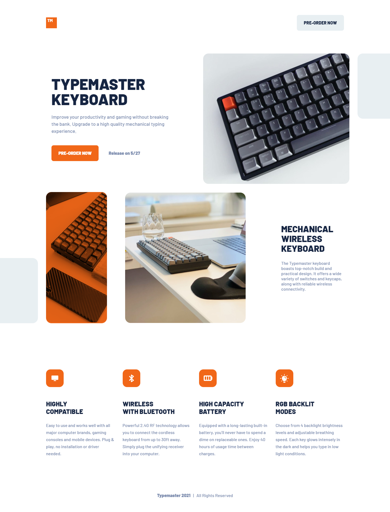
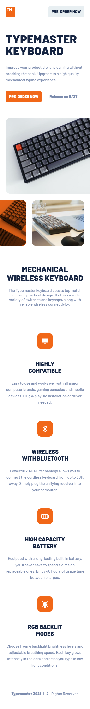

# Frontend Mentor - Typemaster pre-launch landing page solution

This is a solution to the [Typemaster pre-launch landing page challenge on Frontend Mentor](https://www.frontendmentor.io/challenges/typemaster-prelaunch-landing-page-J6-Yj5J-X). Frontend Mentor challenges help you improve your coding skills by building realistic projects.

## Table of contents

- [Overview](#overview)
  - [The challenge](#the-challenge)
  - [Screenshot](#screenshot)
  - [Links](#links)
- [My process](#my-process)
  - [Built with](#built-with)
  - [What I learned](#what-i-learned)
- [Author](#author)

## Overview

### The challenge

Users should be able to:

- View the optimal layout for the page depending on their device's screen size
- See hover states for all interactive elements on the page

### Screenshot

### Links

- Solution URL: (https://www.frontendmentor.io/solutions/responsive-pre-launch-landing-page-Ih6Z6R9NC)
- Live Site URL: (https://lm-typemaster-landing-page.netlify.app/)

## My process

### Built with

- Semantic HTML5 markup
- CSS custom properties/vars
- Desktop-first workflow

### What I learned

I practiced the mix-blend-mode, which was required on the orange overlay on one of the images, however it mixed with the colours of the image.

I also used &nsbp for the first time in html which is non breaking space to create extra space between letters in the footer text.

## Author

- Website - [Leon Michalak](https://www.leonmichalak.tech)
- Frontend Mentor - [@NinjaInShade](https://www.frontendmentor.io/profile/NinjaInShade)
- Instagram - [@lmdeveloper](https://www.instagram.com/lmdeveloper/)
